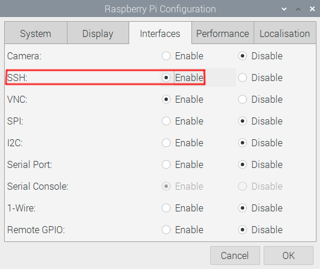
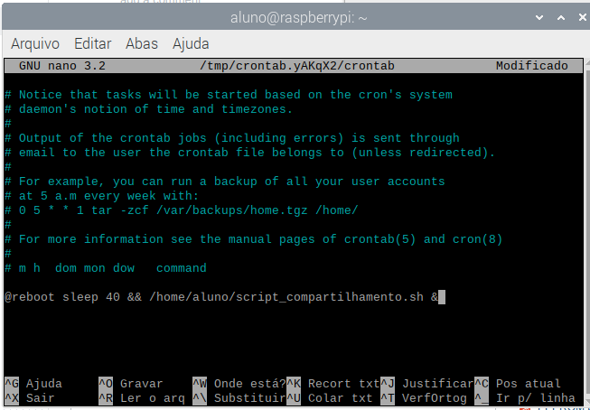
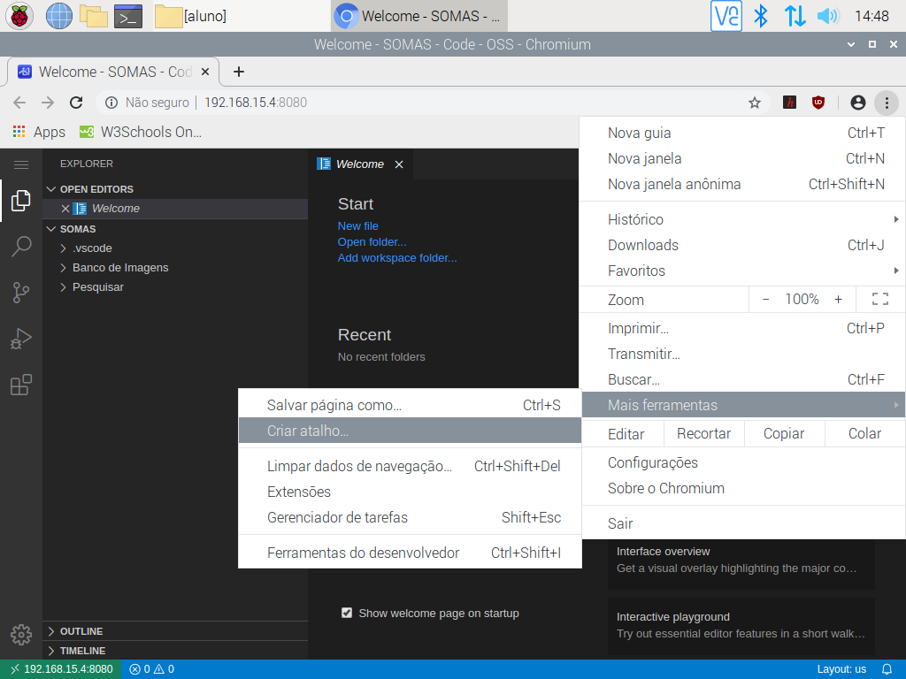
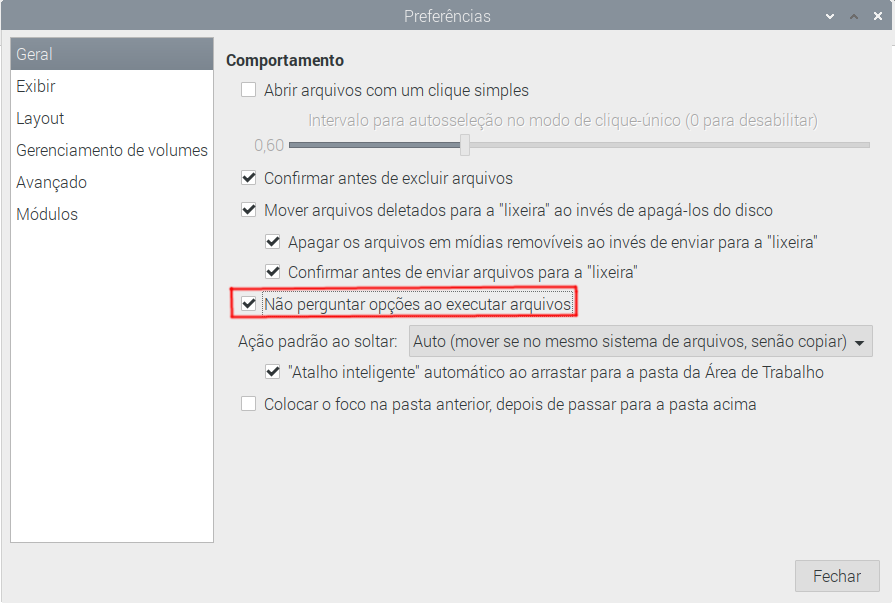
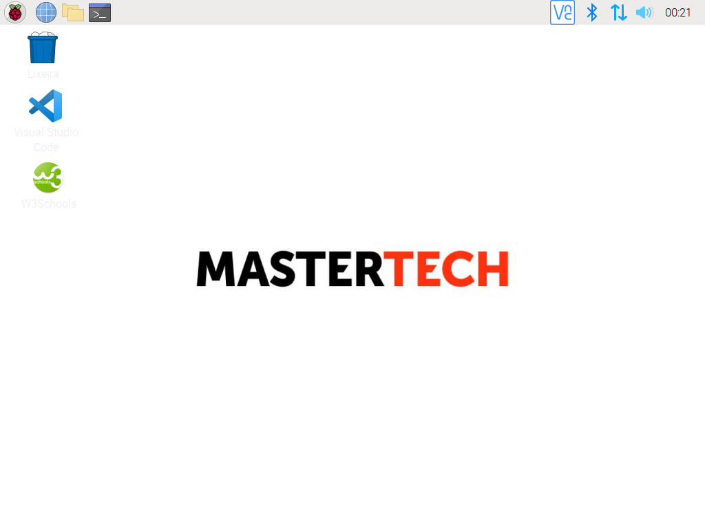

## Tutorial para configuração da Raspberry Pi do kit aluno.

Este tutorial foi feito para o sistema operacional Raspberry Pi OS. É importante que a máquina esteja logada numa conta chamada "aluno" e que o SO esteja em português (Caso a máquina tenha outro nome, será necessário trocar todas as ocorrências da palavra "aluno" no script de instalação da Raspberry Pi/Labrador do aluno e nas configurações dos atalhos criados para o W3Schools e o VSCode).
Para que tudo seja configurado corretamente, é importante que a máquina do professor seja configurada primeiro e a Raspberry Pi/Labrador seja configurado depois. É importante também que ambas as máquinas estejam conectadas na mesma rede Wi-fi.

### Ativando SSH

Primeiramente é necessário ativar a conexão SSH da Raspberry Pi. Para isso, abra as configurações da Raspberry Pi pelo menu inicial, vá na aba "Interfaces" e selecione a opção "Enable" do SSH, como mostra a imagem a seguir.



### Criando a key-pair e enviando para o professor
Para que a montagem da pasta compartilhada possa acontecer sem que o usuário precise inserir a senha da máquina do professor sempre que a Raspberry Pi for inicializada, é possível enviar a chave pública da conta do aluno para a máquina do professor via SSH.

Caso a conta do aluno ainda não tenha um key-pair, é possível gerá-lo executando o comando a seguir no terminal.

```console
ssh-keygen -t rsa
```

Ao executar este comando, aperte enter para todas as opções que aparecer, para que a chave tenha as configurações padrão e não solicite senha durante as conexões com a máquina do professor.

Para enviar a chave pública para o notebook do professor é necessário executar o comando a seguir, alterando "IP_Profesor" para o IP da máquina do professor.

```console
sh-copy-id -i ~/.ssh/id_rsa.pub professor@IP_Professor
```

Quando for solicitado, confirme a transferência digitando "yes" e apertando a tecla Enter.
Insira a senha do notebook do professor caso ela seja solicitada.

### Utilizando o script de instalação

Para que os programas sejam instalados e o sistema operacional seja configurado, foi criado um script de instalação. Copie ou baixe o script na Raspberry Pi do kit aluno e, antes de utilizá-lo, edite-o com o editor de texto de sua preferência: Troque a variável "IP_Professor" que está na 5ª linha do arquivo para o IP da máquina do professor.

É necessário também alterar a permissão deste script, para que ele possa ser executado. Para isso, navegue com o terminal até a pasta onde o script se encontra e execute o comando a seguir.

```console
chmod u+x script_aluno
```

Pronto, para executá-lo, rode o comando a seguir no mesmo terminal.

```console
./script_aluno
```

Caso seja solicitado, insira a senha do root da Raspberry Pi.

Aguarde o término do script, e quando isto acontecer todos os softwares já estarão instalados.

### Crontab

Para que a pasta "SOMAS", que foi criada pelo script, possa ser montada com a pasta "SOMAS" do notebook do professor, e assim permitir o compartilhamento de arquivos sem a necessidade de internet, é necessário que esta pasta seja montada via SSHFS na pasta remota sempre que a Raspberry Pi iniciar.

Essa montagem apenas poderá acontecer se o notebook do professor e a Raspberry Pi estiverem conectados na mesma rede Wi-fi. Assim, foi utilizado um script disponibilizado em um fórum da internet (Fonte: https://askubuntu.com/questions/3299/how-to-run-cron-job-when-network-is-up ), que se encontra no arquivo "script_compartilhamento.sh" deste repositório GIT, que realiza um ping na rede para saber se a Raspberry Pi já está conectada ao Wi-fi. Caso ela não esteja, o ping é realizado outras vezes para verificar a conexão novamente. Essa checagem acontecerá no máximo 5 vezes. Caso o ping retorne indicando que a Raspberry Pi nunca se conectou, a montagem não acontecerá. Caso o ping retorne indicando que a Raspberry Pi está conectada ao Wi-fi, a montagem da pasta local com a pasta remota será realizada.

E para que este script seja executado sempre que a Raspberry Pi seja iniciada, foi adicionada uma linha ao Crontab da conta do aluno, indicando que esse script deve ser sempre executado 40 segundos depois que a Raspberry Pi iniciar (para dar tempo de logar na conta do aluno).

Para configurar o Crontab para fazer isso, é necessário rodar o comando a seguir para editar o arquivo

```console
crontab -e
```

e adicionar a linha a seguir no final do arquivo (verifique se o script realmente está na pasta indicada).

```console
@reboot sleep 40 && /home/aluno/script_compartilhamento.sh &
```

O arquivo deve ficar desta forma:



Pronto, sempre que a Raspberry PI for inicializada e a conexão com Wi-fi for estabelecida, a pasta local será montada com a pasta remota. É importante assim, sempre conectar o notebook do professor ao Wi-fi antes de inicializar a Raspberry Pi.

Desta forma, tudo que for adicionado numa pasta "SOMAS" que foi montada na pasta "SOMAS" do notebook do professor estará disponível para o professor e para todas as outras pastas "SOMAS" montadas em dispositivos que estão na mesma rede.

### Atalhos

A pasta compartilhada automaticamente terá um atalho na área de trabalho, quando ela for montada.

Para criar o atalho do W3Schools, copie o arquivo W3Schools.desktop deste repositório GIT para sua Área de Trabalho.

E para criar o atalho do VSCode, abra o navegador web Chromium e vá para o endereço "IP_Professor:8080" (substituindo IP_Professor pelo IP do notebook do professor), clique no botão com três pontos no navegador, clique em "Mais ferramentas" no menu drop-down que abrir e em seguida clique em criar atalho, como mostra a imagem a seguir.



Clique em criar na janela de confirmação que aparecer, e um arquivo novo irá aparecer na sua área de trabalho. 
Edite este arquivo com o editor de texto da sua preferência, alterando-o para que as categorias "Encoding", "Name", "Comment", "Icon" e "Name[pt_BR]" fiquem iguais as do arquivo VSCode.desktop deste repositório GIT. As outras categorias devem permanecer inalteradas.

Volte no explorador de arquivos, clique em "Editar" e em seguida em "Preferências". Selecione a opção "Não perguntar opções ao executar arquivos" e clique em "Fechar", como mostra a imagem a seguir.



Teste cada um dos atalhos para verificar se eles funcionarão como o esperado (O atalho do VSCode apenas funcionará caso o comando do code-server estiver sendo executado no terminal do notebook do professor).

A área de trabalho do notebook do professor deverá se parecer com a imagem a seguir.




### Configuração das outras Raspberry Pi's

Para configurar as outras Raspberry Pi's com mais facilidade e rapidez, basta gerar uma imagem .iso do sistema operacional já configurado da Raspberry Pi que já está configurada e gravar essa imagem nos cartões microSD das outras Raspberry Pi's. A geração desta imagem e a gravação da mesma pode ser realizada com o comando 'dd' via terminal.
